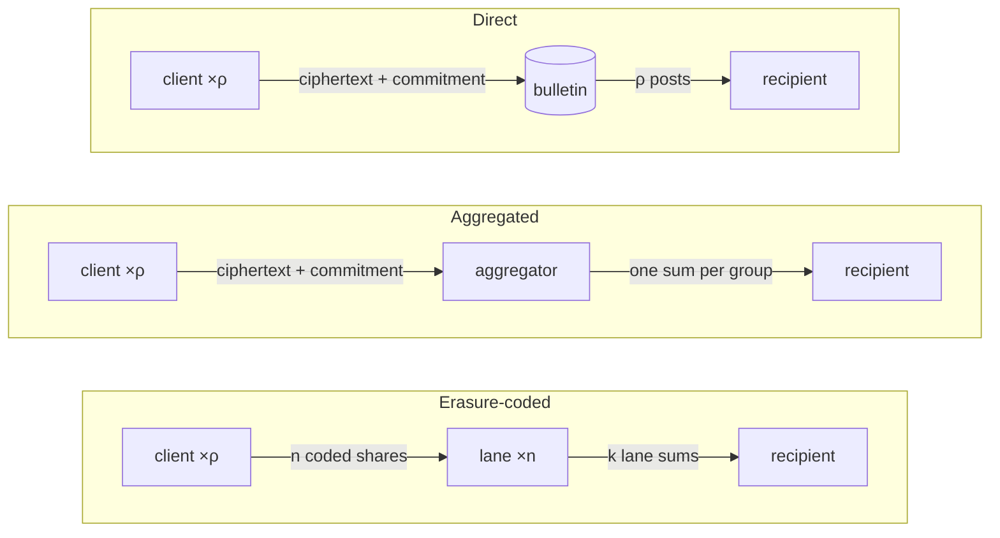
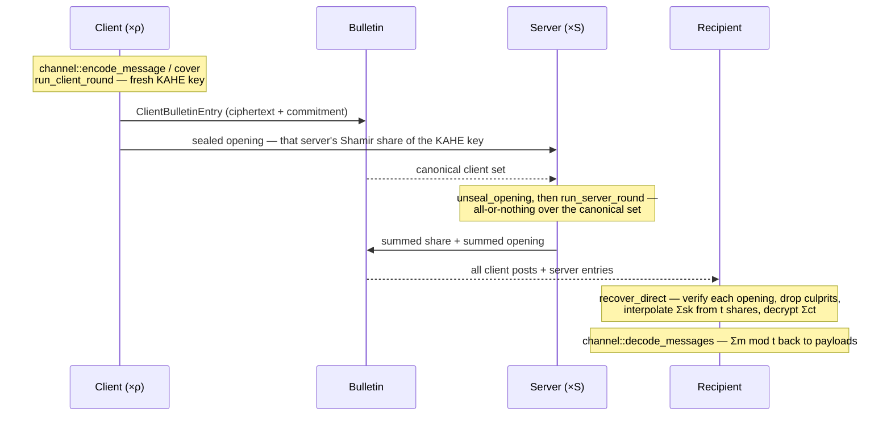

# Panetière

This repository is a reference implementation of **Panetière: Efficient Anonymous Broadcast**, an efficient anonymous broadcast
protocol. Clients each publish one message; a threshold of servers cooperates to
reveal the *sum* of the clients' encrypted vectors and nothing else, and an application-side
encoding turns that sum back into the individual messages. Not audited — do not use in production.

This file is the integration guide: architecture, roles, and the call sequence.

Ring arithmetic comes from [negacyclic-rings](https://github.com/Ruteri/negacyclic-rings).
[Chipmunk](https://github.com/Ruteri/Chipmunk) supplies the Ring-SIS hash and
Merkle tree used by the commitment layer.

## Roles

- **Client** — encrypts its vector under a fresh KAHE key, Shamir-shares *that
  key* across the servers, and commits to the shares. Each share rides an
  ML-KEM-sealed envelope to its server: the key material is what matters, the
  envelope is only transport. Clients run inside a TEE, but a client that breaks TEEs
  costs liveness, not privacy; the client image lives in [github.com/flashbots/flashbots-images](https://github.com/flashbots/flashbots-images).
- **Server** — holds one Shamir share of every client's KAHE key. It publishes
  the sum of those shares together with a summed opening that verifies against
  the summed commitment, which is what stops it publishing a wrong sum.
- **Recipient** — verifies the openings, interpolates $\sum sk$ from any $t$ summed
  shares, decrypts $\sum ct$, decodes.

Any $t$ shares reconstruct $\sum sk$, so **anonymity needs enough servers to refuse
to decrypt over any client set other than the canonical one — at least
$S - t + 1$ of them.** The canonical set is a slice the caller supplies; the verifier
only checks that the servers it counts agree on it. `ProtocolParams::min_clients` and
`SetPolicy::min_clients` bound its size.

## Architecture

Everything over the ring arithmetic is linear in the payload — encryption,
commitment, erasure coding and the payload encodings all commute with summation,
which is what makes the round work. Panetière owns its ring parameters and thin
semantic types in `src/rings.rs`; `negacyclic-rings` provides the arithmetic.
The layers above are, bottom-up, the schemes (`kahe`, `sss`, `cs`, `rs`, `pke`,
`sig`), the round drivers under `protocol::`, and the payload encodings a caller
picks between (`channel`, `mse`, `prony`, `codec`), which all produce and consume
`Vec<KahePoly>`.

| Module | |
|---|---|
| `kahe` | key-additive homomorphic encryption, plus the CS↔KAHE bridge |
| `sss` | Shamir *t*-of-*n* (and additive) sharing over the CS ring |
| `cs` | additive vector commitment with addition hiding; `Opening` wire form |
| `rs` | systematic Reed–Solomon erasure coding over the KAHE RNS channels |
| `share_commitment` | commitment to the $n$ coded shares, one tree leaf per lane |
| `pke` / `sig` | ML-KEM-768 + AES-GCM envelopes for the key shares / P-256 post signatures |
| `bulletin` | published entry types and their byte encodings |
| `protocol::*` | the round drivers, verifier, recipient policy |
| `channel` | recommended payload layer: sizes either encoding for $\rho$ messages of $n$ bytes |
| `mse` / `prony` | the two multiset encodings (peeling; MDS sketch) |
| `codec` | raw byte↔poly packing and beacon-driven slot reservation |
| `scaling_bench` | harness behind `panetiere_scaling` / `panetiere_merge` |

## Ingress modes

**Direct** is the protocol itself: each client posts its ciphertext and
commitment, and the recipient downloads all of them. That download is the
bottleneck — at the reference cell below it is 2.12 GB per round (300 clients ×
7.06 MB of ciphertext) against 0.14 GB of key-share envelopes, and 6.15 GB with
the peeling encoding in place of the sketch.

**Aggregators** and **erasure-coding lanes** are two practical improvements that
attack exactly that term. An aggregator serves a group of clients and publishes
one summed ciphertext and commitment for the whole group; it is untrusted, since
anyone can re-sum the group and catch it. Erasure-coding lanes go further: the
ciphertext never goes on the bulletin at all, but leaves the client as $n$ coded
shares, and the recipient reconstructs $\sum ct$ from any $k$ lane sums — so what a
client posts is constant size in the message: the key-share commitment, plus a
second commitment covering the $n$ coded shares, signed. Servers can double as
lanes; extra lanes hold no key material.

Client crypto and the server round are the same in all three, and key shares
stay per-server and sealed throughout, so the threshold and privacy model does
not change.



| | **Direct** | **Aggregated** | **Erasure-coded** |
|---|---|---|---|
| Setup | `ProtocolParams::setup*` | `ProtocolParams::setup*` | `setup_rs_mode` |
| Client posts | ciphertext + commitment | same, to its aggregator | both commitments + signature — constant size in message length |
| Ciphertext travels | on the bulletin | summed per group | as $n$ coded shares, one per lane |
| Client fn | `run_client_round` | `run_client_round` | `run_client_round_rs` |
| Recipient fn | `recover_direct` | `recover_aggregated` | `aggregate_and_decrypt_rs` |
| Extra checks | — | — | signatures; each lane's sum opens the summed share commitments |

## Integration

One direct round, end to end:



### Setup

```rust
let pp = ProtocolParams::setup(&mut rng, n_servers);              // or setup_with_threshold,
                                                                   // setup_with_kahe_dims[_full],
                                                                   // setup_rs_mode
let server_key = pke::PrivateKey::generate(&mut rng);              // one per server
let servers: Vec<(ServerId, pke::PublicKey)> = /* ordered by ServerId */;
let session = SessionId(/* 32 fresh bytes */);
```

`ProtocolParams` is the CRS — every party must use the same instance (derive it
from a shared seed). `ServerId(i)` is the server's index into that set;
`NodeId(j) < n_nodes`. **`SessionId` must be unique per execution:** sealed
openings are bound to `(sid, client_id, server_id)` as AEAD associated data, so
reuse lets an envelope be replayed from one round into another. Clients also
need a `sig::SigningKey` in RS mode. Confidentiality is post-quantum and
signatures are not, deliberately: a recorded envelope stays attackable forever,
a forged signature only matters before the post is made.

### Payload layer

This fixes $\mu_\mathrm{kahe}$. Every client contributes exactly `message_polys(pp)`
polys, real or cover — `zero_message(pp)` is the trivial cover.

`channel` is the default: it sizes an encoding from "$\rho$ clients, $n$ bytes
each", does the byte↔symbol packing, and derives matching `ProtocolParams`.

```rust
let ch = ChannelParams::for_messages(rho, message_bytes, prf_key);  // peeling
let pp = ch.protocol_params(&mut rng, n_servers);       // KAHE width == ch.n_polys()

let mine = channel::encode_message(&mut rng, &ch, payload)?;   // or channel::cover(&ch)
// ... round ...
let msgs: Vec<Vec<u8>> = channel::decode_messages(&ch, &plaintext, Some(active))?;
```

`ChannelParams` covers both multiset encodings behind that one interface:
`for_messages` / `for_symbols` / `from_mse` build the peeling variant,
`prony_for_messages` / `prony_for_symbols` / `from_prony` the Vandermonde
sketch. The sketch is \~3× smaller per client, hence \~3× less ciphertext to move,
but recovery is all-or-nothing rather than gracefully degrading; it also needs a
prime plaintext modulus, which `protocol_params` handles by selecting
`PRONY_PRIME` for that variant. `mse` / `prony` directly when you want to choose
$\gamma$, $\delta$, $\xi$, capacity or slack yourself. `codec` for non-multiset layouts (disjoint
slots, or a reservation schedule via `beacon` / `allocate` / `encode_at` /
`decode_ranges`) — use `encode_raw`/`decode_raw` there, since `encode`/`decode`
carry a per-coefficient length header that multiplies under summation.

### Client

```rust
pub fn run_client_round<R: CryptoRng + Rng>(
    rng: &mut R, pp: &ProtocolParams, sid: &SessionId, client_id: ClientId,
    message: Vec<KahePoly>, servers: &[(ServerId, pke::PublicKey)],
) -> ClientRound;                     // { client_id, encrypted_message, sealed_openings }

pub fn run_client_round_rs<R: CryptoRng + Rng>(
    rng: &mut R, pp: &ProtocolParams, sid: &SessionId, client_id: ClientId,
    message: Vec<KahePoly>, servers: &[(ServerId, pke::PublicKey)],
    signing_key: &SigningKey,
) -> RsClientRound;                   // { client_id, bulletin, sealed_openings,
                                      //   rs_shares, share_paths }
```

The expensive message-independent work can run ahead using the ordinary APIs.
Build the next round with an all-zero plaintext, then consume it once the
message arrives:

```rust
let zero = run_client_round(
    &mut rng, &pp, &next_session, client_id, zero_message(&pp), &servers,
);
// ... later ...
let round = zero.with_message(&message);
```

This moves key generation, zero encryption, Shamir sharing, the key-share
commitment, and sealed openings out of the message-critical path. `with_message`
consumes the zero round so it cannot be reused accidentally. In RS mode the same
pattern is available as
`zero.with_message(&pp, &next_session, &message, &signing_key)`; RS encoding of
the zero ciphertext is reused, while the final share commitment and signature
are rebuilt because they bind the message-dependent shares.

Publish `encrypted_message` / `bulletin`; send `sealed_openings[i]` to server
`i` over any channel (already CCA2-sealed and context-bound); with erasure
coding, send `(rs_shares[j], share_paths[j])` to lane `j` — the path is that
lane's opening of the share commitment, 42 KiB at $n = 16$, and the lane
recomputes everything else from the share. Each envelope holds a commitment
`Opening` whose committed value is that server's Shamir share of the KAHE key —
that share is the secret, the envelope only carries it. `servers` must be
ordered by `ServerId`, and
`sealed_openings` comes back in that order. The key is fresh per round — a hard
requirement of the scheme. The phases are also public individually
(`kahe_keygen`, `kahe_encrypt`, `shamir_share`, `cs_commit`, `seal_openings`)
for callers that need to split or interleave them.

### Server

```rust
let op = unseal_opening(&server_key, &session, client_id, server_id, sealed)?;  // Option
let entry = run_server_round(&ServerInbox { server_id, items }, canonical)?;
```

The round is **all-or-nothing over `canonical`**: a client in the set with
nothing in the inbox returns `ServerRoundError::MissingClient` rather than
summing a smaller set, because $\sum sk$ and $\sum ct$ must cover exactly the same
clients or decryption yields noise. Extra inbox entries are ignored, so the same
round can be re-run over any subset of what arrived. `unseal_openings` is the
batch form.

A server can double as an erasure-coding lane, in which case it also runs, over
the same set and under the same all-or-nothing contract, with no key material
involved:

```rust
pub fn run_rs_node_round(
    scp: &ShareCommitmentParams,          // pp.share_comm.as_ref().unwrap()
    inbox: &RsNodeInbox,                  // { node_id, items: Vec<(ClientId, Share, SharePath)> }
    canonical: &[ClientId],
    roots: &[(ClientId, HVCPoly)],        // each client's signed share_root, off the bulletin
) -> Result<RsNodeBulletinEntry, ServerRoundError>;
```

The lane sums the shares and their openings and proves the pair in one shot, so
the cost is one commitment check per round rather than one per client. If that
check fails it re-checks per client and returns `BadShare(cid)`; if every client
passes individually the roster exceeded $\rho_\mathrm{max}$ and it returns
`AggregateOverCapacity` instead of blaming a client. The published
`RsNodeBulletinEntry { node_id, clients, share_sum, agg_open }` carries its own
proof, so nothing downstream trusts the lane.

### Recipient

Prefer `protocol::recipient` over calling `verify` directly: it owns the
canonical-set rule and drops faulty servers instead of failing the round.

```rust
let policy = SetPolicy::anchored(&announced, min_clients, max_clients);
let Recovered { canonical, plaintext, culprits } =
    recover_direct(&pp, &policy, |cid| bulletin.get(cid), &server_outputs)?;
```

Decoding is strictly over the canonical client set: servers that shared over
any other set do not count towards $t$. `culprits` are the servers excluded to
reach the threshold. `recover_aggregated` is the same over `(group client set,
summed entry)` pairs. `recover_once` is one attempt over a caller-named set with
no exclusion.

Underneath: `aggregate_and_decrypt` (+ `_timed`), `decrypt_aggregate` for a
pre-summed ciphertext, and `aggregate_and_decrypt_rs` for RS mode (no recipient
wrapper — call it directly). All return $\sum m_i \bmod t$ as `Vec<KahePoly>`, which
goes straight back to the payload layer.

### Aggregator

`run_aggregator_round(&entries) -> AggregatedPublic` sums a group's ciphertexts
and commitments; both are coefficient-wise, hence associative, so the recipient
re-sums groups with the same operations and gets the direct round's value.

In erasure-coded mode each lane's post is checked on its own: the opening must
walk to the sum of the roots the clients signed, and the lane's share sum must
hash to what that opening projects to. A lane whose sum is wrong is named in
`VerifyError::LaneOpeningFailed(Vec<NodeId>)`, and the verifier re-encodes the
reconstruction and compares every reporting lane, so a liar is named in any
round that reconstructs at all. Nothing here needs an honest lane majority.

## Errors

Two `VerifyError` variants are server-attributable and carry an index into
`server_outputs`: `InvalidServerOpening(i)` and `ShareOpeningMismatch(i)`. In RS
mode `LaneOpeningFailed(Vec<NodeId>)` is lane-attributable and
`BadSignature(ClientId)` client-attributable; the `recover_*` wrappers do not
cover RS mode, so acting on those is the caller's. The
`recover_*` functions act on exactly those, excluding and retrying until $t$
remain; everything else fails the round. A rejected round comes back as
`RecipientError::Rejected(RejectReason)`, so a caller can report *why* rather
than "no output". `RecipientError::BelowShareThreshold` is expected early in a
round and is worth demoting to trace level.

On the payload side, an over-subscribed structure surfaces as
`ChannelError::PeelStalled` or `ChannelError::SketchFailed(PronyError::{CapacityExceeded,
NotSplit, CheckFailed})` — never as a successfully decoded empty round.
`CodecError::CoeffOutOfRange` means a per-coefficient sum overflowed the symbol
modulus, i.e. the slot layout let two clients collide. A `None` from
`unseal_opening` is wrong session, wrong client/server, or a tampered envelope.

Nothing that arrives over the wire can panic a peer. Every remote input is
validated and rejected by value: `PackedOpening::from_bytes` and
`Opening::from_packed` bound the declared header before allocating,
`Cs::sum_openings` returns `None` if the openings disagree on shape or position,
`open_share` and `verify_aggregated` gate lane index and buffer lengths,
`Rs::reconstruct` and `ShamirSharing::recover` check index range and
distinctness, and the verifier rejects an out-of-range or duplicated
`ServerId`/`NodeId` before using it. The `assert!`s that remain are on locally
supplied arguments — parameter constructors (`setup_rs_mode`, `ShamirParams::new`,
`MseParams::new`, `PronyParams::new`, `RsParams::new`) and payload arity in
`MseEncoding::insert` / `PronyEncoding::insert_with_z` — where a violation is a
caller bug, not an attack. Range checks on the ring bridges are `debug_assert!`,
so they only run in the debug test profile.

## Wire formats

The crate serialises the crypto objects and nothing else — framing, transport,
retries and authenticated delivery are the caller's.

- `ClientBulletinEntry::{to_bytes, from_bytes, packed_len}` and
  `RsClientBulletinEntry::{to_bytes, from_bytes, packed_len, signing_bytes}`
  (the RS post's length is independent of the message, so `packed_len()` takes
  no argument — 8801 B: two packed roots, a P-256 point and a signature).
- Lane traffic is sized by `share_commitment::{fresh_path_packed_len,
  lane_post_packed_len}`; a `SharePath` is what the client sends with each
  share, and a lane's post is its share sum plus the summed opening.
- `Commitment::{to_bytes, from_bytes}`, `pack_cs_shares` / `unpack_cs_shares`.
- Openings are bit-packed per region at the tightest width, so the bounds
  matter: `Opening::pack(r_bound, s_bound, tree_bound)` with
  `fresh_opening_pack_bounds(&pp.cs)` for a client opening and
  `aggregated_opening_pack_bounds(&pp.cs, rho)` for a server's, then
  `PackedOpening::{to_bytes, from_bytes}` and `Opening::from_packed`.
- `round_wire_sizes(n_servers, ctxt_polys, rho)` budgets a round without
  sampling a CRS.

`bulletin::InMemoryBulletin` is a `Mutex`-backed vector for tests and the demo —
no persistence, ordering or authentication. It is not a bulletin board.

## Tests and benches

```sh
RAYON_NUM_THREADS=8 cargo test -j 8
RAYON_NUM_THREADS=8 cargo bench -j 8 --bench protocol_sweep   # (S, ρ) × encoding sweep
```

KAHE and the CS auxiliary domain use two-prime RNS parameter sets from
`src/rings.rs`. Their 32-bit NTT channels dispatch to scalar, AVX2, or NEON.
CS and Prony retain their semantic prime fields.

The integration tests are the executable spec: `end_to_end.rs` (canonical round,
slot mode, *t*-of-*n*, replay/tamper/norm rejection, anonymity floor, thread
invariance), `mse_e2e.rs` and `prony_e2e.rs` (each encoding carried end-to-end,
with cover traffic), `rs_mode_e2e.rs` (lanes, constant-size posts, a lying lane
named, a bad share named at its lane, capacity faults not blamed on clients),
`recipient_e2e.rs` (anchor admission, culprit exclusion, every `RejectReason`).

The sweep binary takes its cells from the environment (`SWEEP_CLIENTS=300x300`,
`SWEEP_PAYLOAD_SYMBOLS`, `SWEEP_RS`, `BENCH_BUDGET_SECS`) and writes one CSV row
per cell to `BENCH_CSV`. `BENCH_ROLES` selects which roles a run *records* — the
full round executes either way, so a client measured in a TEE and everything
else measured on the host walk identical code:

```sh
taskset -c 0-7 env RAYON_NUM_THREADS=8 BENCH_ROLES=server,verifier,agg,rs \
    BENCH_CSV=host.csv ./target/release/panetiere_scaling
RAYON_NUM_THREADS=8 BENCH_ROLES=client BENCH_CSV=tdx.csv ./panetiere_scaling   # in the VM
./target/release/panetiere_merge tdx.csv host.csv merged.csv
```

`panetiere_merge` splices at row level — it re-runs the cost model over the
spliced timings, refuses runs with differing thread counts, and asserts the
exact-arithmetic sizes agree, so a mismatch means the runs describe different
cells.

## Performance

Measured on a 16-core 3.9 GHz Intel Xeon Gold 6526Y with 503 GB of memory,
Ubuntu 26.04 / kernel 7.0.0-22, TDX enabled. The client runs in an 8-vCPU,
64 GB TDX VM under QEMU on the same host; every workload is core-pinned,
including the VM's vCPUs, and everything uses 8 threads.

### CPU and bytes per round

Prony sketch encoding (`channel` / `prony`), 8 servers, direct mode. "300 / 100"
is cover traffic: 300 clients in the anonymity set, 100 of them sending.

| Message | Clients | Client | Server | Recipient | Cl→Srv | Cl→Rec | Srv→Rec | Rec. ingress |
|---|---|---|---|---|---|---|---|---|
| 4 KB | 100 | 35.2 ms | 15.7 ms | 30.5 ms | 0.47 MB | 0.61 MB | 109 KB | 0.06 GB |
| 4 KB | 300 / 100 | 25.5 ms | 43.7 ms | 32.5 ms | 0.47 MB | 0.61 MB | 124 KB | 0.18 GB |
| 4 KB | 300 | 51.4 ms | 48.0 ms | 154.7 ms | 0.47 MB | 1.78 MB | 124 KB | 0.54 GB |
| 16 KB | 100 | 52.8 ms | 17.8 ms | 49.4 ms | 0.47 MB | 2.37 MB | 109 KB | 0.24 GB |
| 16 KB | 300 / 100 | 40.6 ms | 44.8 ms | 61.1 ms | 0.47 MB | 2.37 MB | 124 KB | 0.71 GB |
| 16 KB | 300 | 85.3 ms | 50.4 ms | 265.8 ms | 0.47 MB | 7.06 MB | 124 KB | 2.12 GB |

### Simulated network throughput

16 servers, 300 × 16 KB, RS at 14-of-16, one-way latency 60 ms + U[0, 10) ms per
message. e2e is measured CPU wall plus simulated transfer; MB/s is the recovered
payload (4.9 MB) over e2e. Peeling carries \~3× these bytes and lands at roughly
a third of these rates.

Prony sketch:

| Links, client / server / bulletin (Mbit/s) | Direct | MB/s | Aggregated | MB/s | Erasure-coded | MB/s |
|---|---|---|---|---|---|---|
| 100 / 1k / 1k | 34.5 s | 0.14 | 2.7 s | 1.81 | 2.9 s | 1.70 |
| 100 / 4k / 4k | 9.1 s | 0.54 | 1.6 s | 3.06 | 2.0 s | 2.47 |
| 100 / 1k / 8k | 4.9 s | 1.01 | 1.8 s | 2.67 | 2.6 s | 1.86 |
| 100 / 1k / 20k | 2.3 s | 2.12 | 1.8 s | 2.76 | 2.6 s | 1.87 |
| 1k / 1k / 4k | 9.1 s | 0.54 | 2.0 s | 2.50 | 2.7 s | 1.83 |
| 1k / 1k / 8k | 4.9 s | 1.01 | 1.8 s | 2.67 | 2.6 s | 1.86 |
| 1k / 1k / 20k | 2.3 s | 2.12 | 1.8 s | 2.76 | 2.6 s | 1.87 |

Slot reservation:

| Links, client / server / bulletin (Mbit/s) | Direct | MB/s | Aggregated | MB/s | Erasure-coded | MB/s |
|---|---|---|---|---|---|---|
| 100 / 1k / 1k | 37.6 s | 0.13 | 2.7 s | 1.79 | 2.9 s | 1.68 |
| 100 / 4k / 4k | 9.8 s | 0.50 | 1.5 s | 3.22 | 1.9 s | 2.52 |
| 100 / 1k / 8k | 5.1 s | 0.96 | 1.8 s | 2.74 | 2.7 s | 1.84 |
| 100 / 1k / 20k | 2.3 s | 2.11 | 1.7 s | 2.85 | 2.7 s | 1.85 |
| 1k / 1k / 4k | 9.8 s | 0.50 | 1.9 s | 2.55 | 2.7 s | 1.81 |
| 1k / 1k / 8k | 5.1 s | 0.96 | 1.8 s | 2.74 | 2.7 s | 1.84 |
| 1k / 1k / 20k | 2.3 s | 2.11 | 1.7 s | 2.85 | 2.7 s | 1.85 |

### Bytes on each link

Same cell (Prony), per ingress mode.

<picture>
  <source media="(prefers-color-scheme: dark)" srcset="docs/traffic-dark.svg">
  
</picture>
